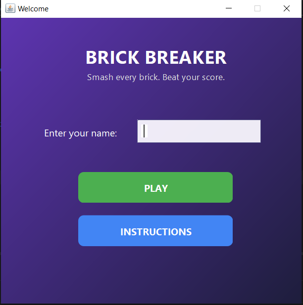
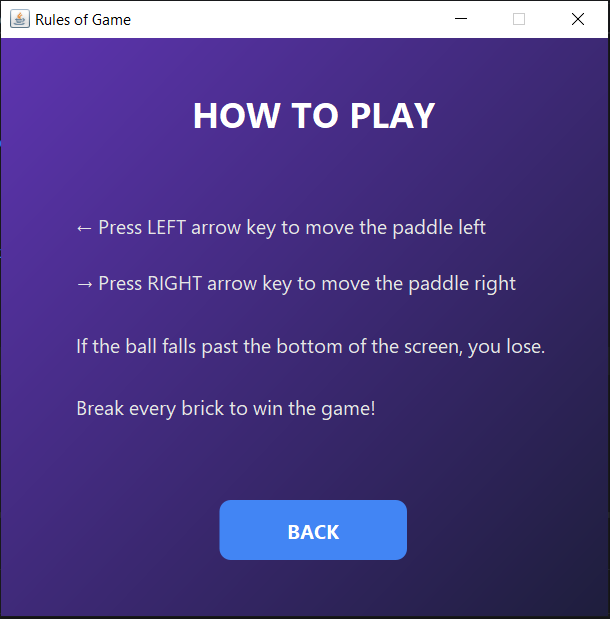
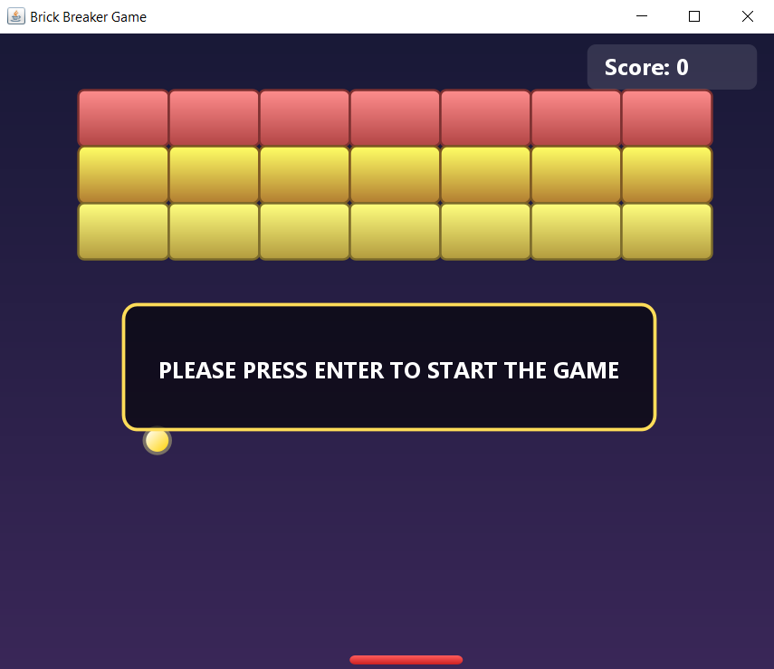
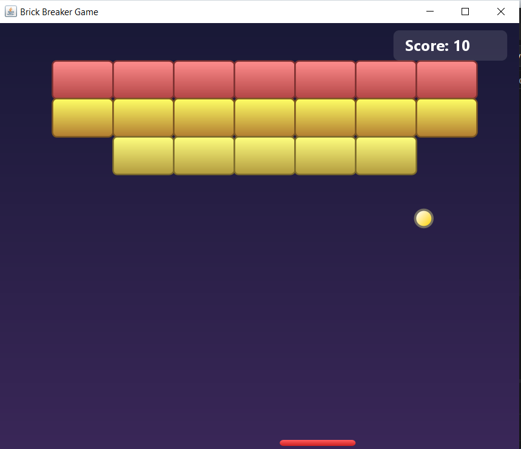
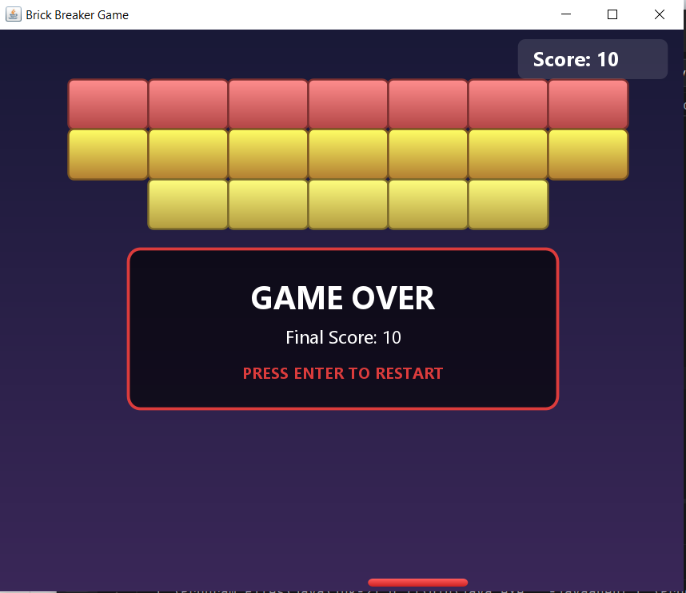

# 🎮 Brick Breaker Game

## 📌 Overview

A classic Brick Breaker game built in Java using Swing and AWT. Move the paddle to bounce the ball, break every brick to win, and don't let the ball fall past the bottom of the screen.

## ✨ Features

- **Dynamic, colorful brick map** generated by `MapGenerator` (3 rows × 7 columns by default), with a distinct color per row
- **Paddle controls** with left/right arrow keys
- **Live score tracking**, displayed in a styled panel during play
- **"Press Enter to start" prompt** shown before the game begins
- **Win/lose end states**, with score saved to `Score.txt`
- **Welcome screen** for entering a player name before starting
- **In-game instructions screen** explaining the controls and rules


## 📸 Screenshots

<h3>Welcome & Instructions</h3>

<p align="center">
  
  
</p>

<h3>Gameplay</h3>

<p align="center">
  
  
</p>

<h3>Score Screen</h3>

<p align="center">
  
</p>

## 🛠 Technology Stack

- **Language:** Java
- **UI:** Java Swing & AWT


## 📂 Project Structure

```text
Brick-Breaker/
├── ProjectCode/
│   ├── Gameplay.java      # Game loop, collisions, physics, and app entry point (main)
│   ├── Instruction.java   # Instructions screen
│   ├── MapGenerator.java  # Generates and manages the brick layout
│   ├── Player.java        # Stores the current player's name
│   └── Welcome.java       # Welcome screen (name entry + start button)
├── screenshots/
│   ├── welcome-screen.png
│   ├── instruction-screen.png
│   ├── game-screen-1.png
│   ├── game-screen-2.png
│   └── score-screen.png
├── Score.txt              # Stores player scores
└── README.md
```

> All files declare `package ProjectCode;`, so they must live inside a folder literally named `ProjectCode` for Java to resolve the package correctly.

## 🚀 How to Run

1. Make sure all files sit inside a folder named `ProjectCode` (they declare `package ProjectCode;`, so the folder name must match).
2. Open the project in your IDE (or the folder containing `ProjectCode` if using the command line).
3. Run the `Gameplay` file — it contains the `main` method and is the entry point for the game.


## 🎮 Controls

- **← / →** — Move the paddle left or right
- **Enter** — Start or restart the game

## 🧠 Concepts Used

This project applies several core Object-Oriented Programming concepts:

- **Encapsulation** — private fields with getters/setters in `Player` and `MapGenerator`
- **Inheritance** — `Gameplay extends JPanel`
- **Interfaces** — `KeyListener` and `ActionListener` implemented across multiple classes
- **Polymorphism** — overridden methods like `paint()`, `actionPerformed()`, `keyPressed()`
- **Composition** — `Gameplay` holds and delegates to a `MapGenerator` instance
- **Static members** — `Player.name` shared across the app via static fields/methods
